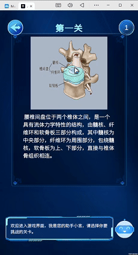
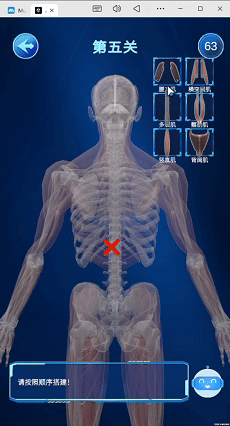
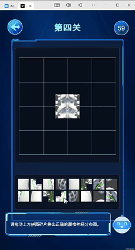

# 交互式3D人体模型拼装软件的核心技术解析

## 核心技术

本项目运用TextAnimator插件实现文字动画效果，借助碰撞检测完成肌肉模型的顺序拼装，并采用十六宫格机制实现神经模型的自由拼图，最终构建出一款具备动态提示与分步操作功能的3D人体模型拼装软件。

### 1. 动态文字输出与打字机效果

- 使用TextAnimator插件实现高性能的逐字输出动画效果。

### 2. 肌肉模型顺序链式拼装

- 为每个可交互肌肉模型设置碰撞体及对应的目标碰撞体。

- 在拖动过程中实时检测碰撞，若碰撞体匹配成功，则完成当前步骤并激活下一步。

- 提供拼装正确时的音效反馈，以及错误时的回退提示（模型复位与错误音效）。

### 3. 神经模型十六宫格自由拼图

- 将完整神经模型网格划分为16个碎片，并为每个碎片及其对应的宫格目标位置设置配对碰撞体。

- 发生碰撞时，系统判断移动碎片是否与当前宫格正确匹配。

- 系统持续统计已正确放置的碎片数量，当全部16块碎片正确归位后，触发完成反馈。
